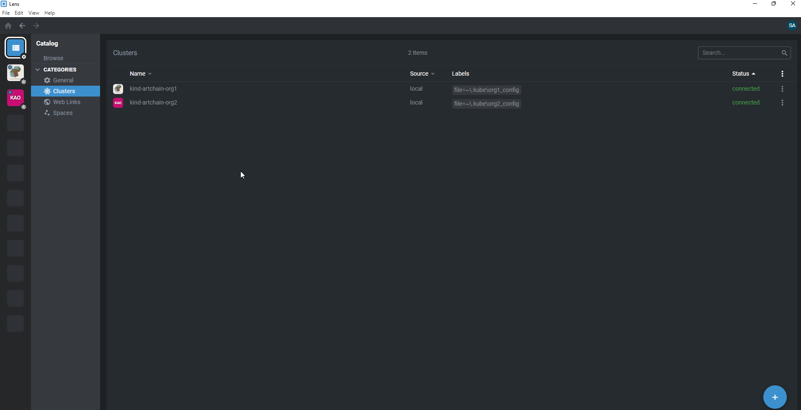

Setup local kubernetes clusters
-------------------------------

1. Install [Virtualbox](https://www.virtualbox.org/) and [Vagrant](https://www.vagrantup.com/)
```
#Install vbguest plugin:
vagrant plugin install vagrant-vbguest
```

2. Build vms for org1 and org2 first
```
  cd local
  vagrant up
```
3. Build vm to run ansible playbook on org1 and org2 
```
  cd ..
  vagrant up
```
4. Copy kube config files to local

You could get your local private key path by run:

```
  vagrant ssh-config
```

```
scp -i C:/Users/songy/source/blockchain/artchain/local/.vagrant/machines/org1/virtualbox/private_key vagrant@192.168.56.12:/home/vagrant/.kube/config C:/Users/songy/.kube/org1_config

scp -i C:/Users/songy/source/blockchain/artchain/local/.vagrant/machines/org2/virtualbox/private_key vagrant@192.168.56.13:/home/vagrant/.kube/config C:/Users/songy/.kube/org2_config
```

5. Install [lens](https://k8slens.dev/) and connect clusters


